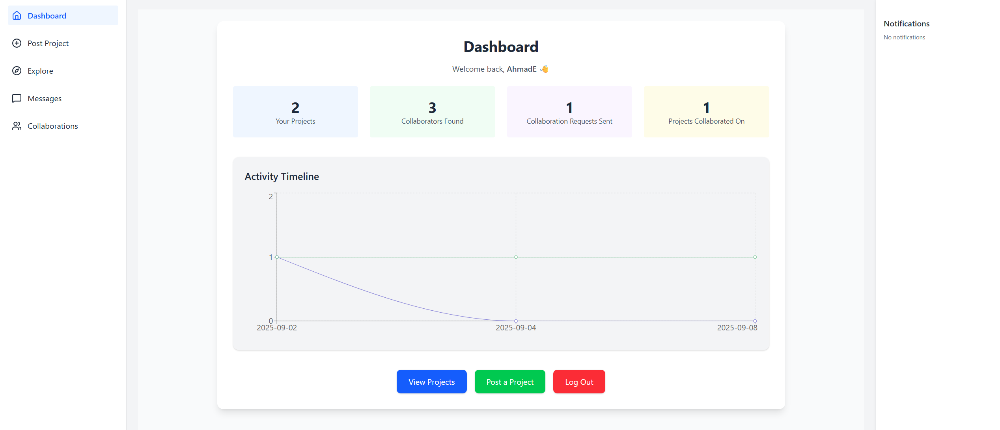
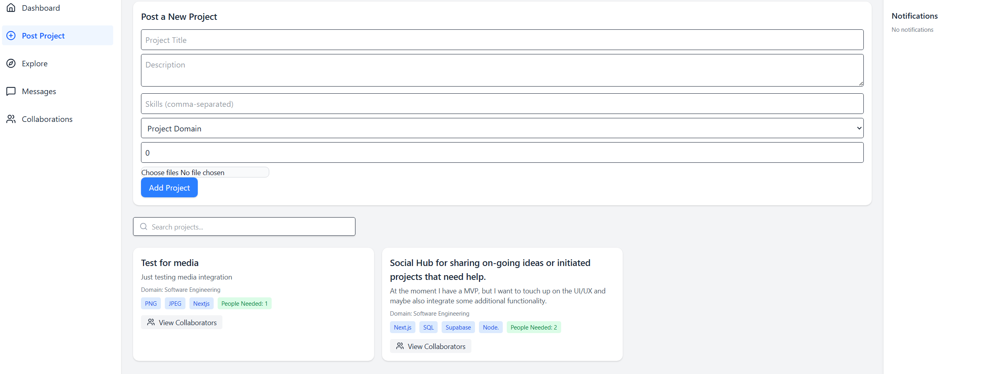
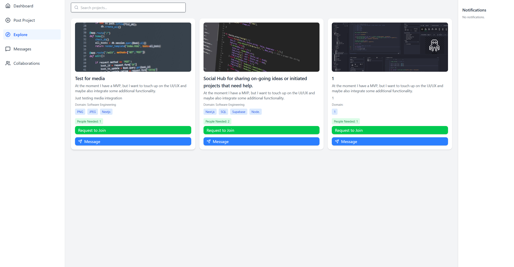
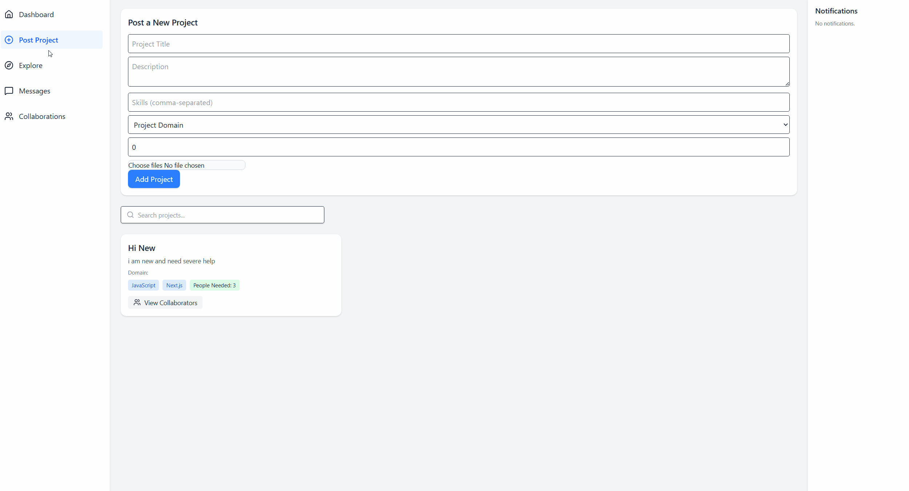

# 🚀 Project Hub (Showcase)

A web platform built with **Next.js + Supabase** that helps creators find collaborators for their personal projects.  
Designed for individuals who want to scale their ideas but don’t have funding — connecting them with people seeking real-world project experience.

---

## 🌟 Features

- **Post Projects** – Create detailed postings with descriptions, images, and videos.  
- **Explore Projects** – Browse projects by category or region.  
- **Collaboration Requests** – Send and receive requests to join projects.  
- **Contributor Dashboard** – Track projects you created, joined, and see who’s contributing.  
- **Real-time Chat** – 1:1 and group messaging with collaborators.  
- **Media-rich Projects** – Showcase work with screenshots, demo videos, and more.  

---

## 🖼️ Screenshots

> (Replace with your actual screenshots, stored in `/media/screenshots/`)

  
*Dashboard – see your projects, contributions, and requests.*

  
*Project Posting – create new project postings with media support.*

  
*Explore – explore projects made by poeple*

---

## 🎥 Demo

  

---

## ⚙️ Tech Stack

- **Frontend:** Next.js, React, Tailwind CSS  
- **Backend:** Supabase (Auth, Database, Storage, RLS)  
- **Media:** Supabase Storage for images and video uploads  
- **Planned Integrations:** Notion (project boards), GitHub (commit analytics, contribution tracking)  

---

## 📌 Roadmap

- ✅ MVP complete: posting, explore, collaboration requests, dashboards, chat  
- ✅ Media support for project postings (images & videos)  
- 🔄 Improved messaging (group chat, direct links from dashboard)  
- 🔜 Integrations with Notion & GitHub  
- 🔜 Location-based project discovery  

---

## 💡 About

**Project Hub** is designed for:  
- Creators who want to scale projects but can’t hire a team  
- Developers, designers, and makers looking for **experience over pay**  
- A quick, collaborative space for connecting and building together  

---

## 🤝 Get Involved

Since this repo is for **showcase only**, the source code is private.  
If you’d like to collaborate, feel free to reach out!

